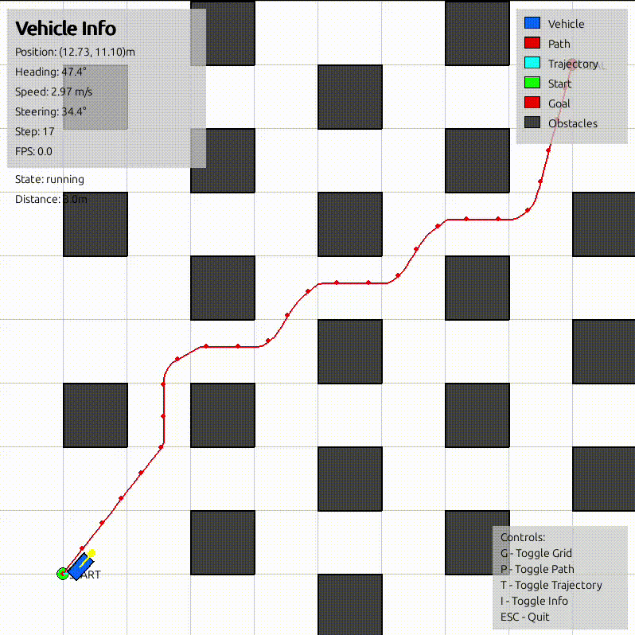
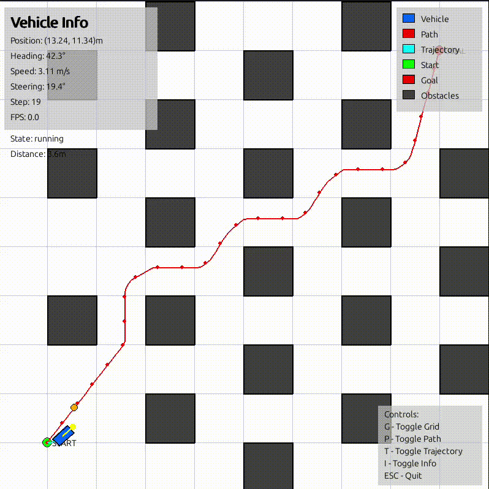
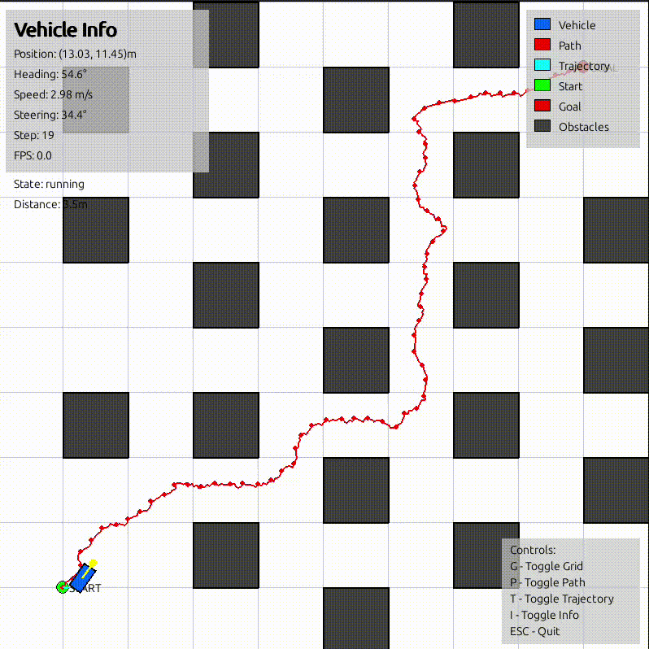
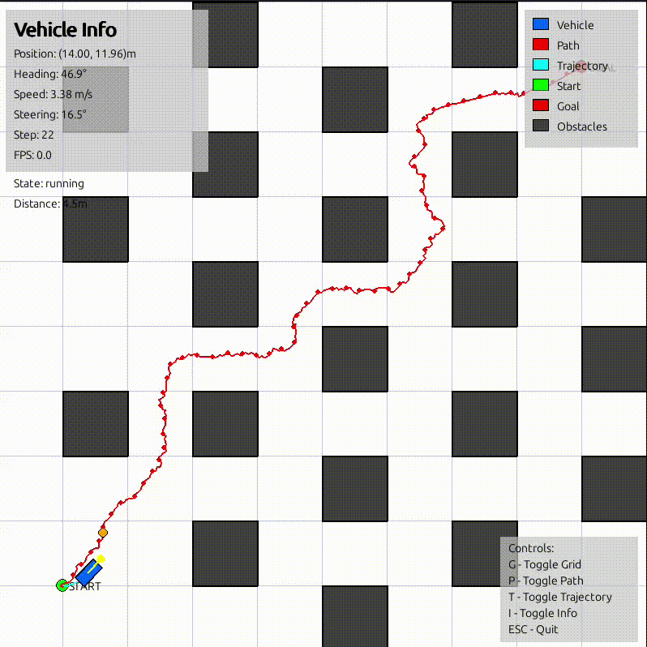

# Autonomous Car 2D Simulation

A 2D autonomous vehicle simulation project that implements various planning, control, and reinforcement learning algorithms for autonomous navigation in a 2D environment.

## Features

- **Core Components**: Vehicle dynamics model and 2D map representation with obstacles
- **Planning Algorithms**: A* path planning and RRT (Rapidly-exploring Random Tree) for path generation
- **Control Systems**: PID controller and Pure Pursuit for vehicle control
- **Reinforcement Learning**: Integration with PPO and SAC algorithms using Stable Baselines3
- **Simulation**: Real-time 2D visualization using Pygame and Matplotlib
- **Configuration**: YAML-based configuration system for easy parameter tuning

## Planning & Control Demos

Demonstration of **Path Planning** algorithms (Rows) combined with **Path Tracking** controllers (Columns).

<table>
  <tr>
    <th align="center">Algorithm \ Controller</th>
    <th align="center">PID</th>
    <th align="center">Pure Pursuit</th>
    <th align="center">Adaptive Pure Pursuit</th>
  </tr>
  <tr>
    <td align="center"><b>A*</b></td>
    <td></td>
    <td></td>
    <td></td>
  </tr>
  <tr>
    <td align="center"><b>RRT</b></td>
    <td></td>
    <td></td>
    <td></td>
  </tr>
</table>

## Reinforcement Learning Demos

Comparison of RL agents (**PPO** vs **SAC**) trained and evaluated on different map difficulties/scenarios.

<table>
  <tr>
    <th align="center">Model \ Map</th>
    <th align="center">Map 1 </th>
    <th align="center">Map 2 </th>
    <th align="center">Map 3 </th>
  </tr>
  <tr>
    <td align="center"><b>PPO</b></td>
    <td></td>
    <td></td>
    <td></td>
  </tr>
  <tr>
    <td align="center"><b>SAC</b></td>
    <td></td>
    <td></td>
    <td></td>
  </tr>
</table>

## Installation

### Prerequisites
- Python 3.12+
- Poetry (for dependency management)

### Setup
1. Clone the repository:
   ```bash
   git clone https://github.com/nctrinh/AutoCAR-2D.git
   cd AutoCAR-2D
   ```

2. Install dependencies using Poetry:
   ```bash
   poetry install
   ```

3. Alternatively, install dependencies manually:
   ```bash
   pip install -r requirements.txt
   ```

## Usage

### Quick Start

All executable scripts are located in the `scripts/` directory. Here are the most common commands:

#### 1. Running 2D Simulation

Run a quick 2D simulation with default configuration:

```bash
# Using Python directly
python scripts/run_sim2d.py --config config/default_config.yaml --max-steps 1000 --fps 30

# Or using the shell script
./scripts/run_sim2d.sh
```

**Options:**
- `--config`: Path to configuration file (default: `config/default_config.yaml`)
- `--max-steps`: Maximum simulation steps (default: 1000)
- `--fps`: Target frames per second (default: 30)

#### 2. Training Reinforcement Learning Models

Train a PPO or SAC model for autonomous driving:

```bash
# Train PPO model
python scripts/run_train_RL.py --config config/RL_config.yaml --algorithm PPO --timesteps 100000

# Train SAC model
python scripts/run_train_RL.py --config config/RL_config.yaml --algorithm SAC --timesteps 100000

# Using the shell script (uses default config)
./scripts/run_train_RL.sh
```

**Options:**
- `--config`: Path to configuration file (default: `config/RL_config.yaml`)
- `--algorithm`: RL algorithm to use (`PPO` or `SAC`)
- `--timesteps`: Number of training timesteps (default: 100000)

**Note:** Training logs are saved to `logs/` directory and can be viewed with TensorBoard:
```bash
tensorboard --logdir logs/
```

#### 3. Evaluating Trained Models

Evaluate a trained RL model:

```bash
# Ensure the model path is correct before executing the script.

# Evaluate PPO model
python scripts/run_evaluate_RL.py --model trained_models/ppo/best_model.zip --episodes 10
# or with visualizaion
python scripts/run_evaluate_RL.py --model trained_models/ppo/best_model.zip --visualize

# Evaluate SAC model
python scripts/run_evaluate_RL.py --model trained_models/sac/best_model.zip --episodes 10
# or with visualizaion
python scripts/run_evaluate_RL.py --model trained_models/sac/best_model.zip --visualize

# Using the shell script
./scripts/run_evaluate_RL.sh
```

**Options:**
- `--model`: Path to trained model file
- `--episodes`: Number of evaluation episodes (default: 10)
- `--visualize`: Using renderer to visualize


## Project Structure

```
autonomous_car_2d/
├── config/                 # Configuration files
│   ├── default_config.yaml
│   └── RL_config.yaml
├── docs/                   # Documentation
├── gif/                    # GIF demonstrations
├── logs/                   # Training logs and TensorBoard events
├── maps/                   # Sample map files
├── notebooks/              # Jupyter notebooks for analysis
├── scripts/                # Executable scripts
├── src/                    # Source code
│   ├── core/               # Core components (vehicle, map)
│   ├── control/            # Control algorithms (PID, Pure Pursuit)
│   ├── learning/           # RL environment
│   ├── planning/           # Path planning algorithms (A*, RRT)
│   ├── simulation/         # Simulation and rendering
│   └── utils/              # Utilities (config loader)
├── tests/                  # Unit tests
└── trained_models/         # Saved trained models
    ├── ppo/
    └── sac/
```

## Dependencies

- numpy: Numerical computations
- scipy: Scientific computing
- matplotlib: Plotting and visualization
- pygame: 2D game development library for simulation
- opencv-python: Computer vision tasks
- pyyaml: YAML configuration parsing
- gymnasium: Reinforcement learning environments
- stable-baselines3: RL algorithms (PPO, SAC)
- tqdm: Progress bars
- rich: Rich text and beautiful formatting
- tensorboard: Experiment tracking and visualization

## Configuration

The project uses YAML configuration files located in the `config/` directory:
- `default_config.yaml`: Default simulation parameters
- `RL_config.yaml`: Reinforcement learning training parameters

Modify these files to adjust simulation settings, vehicle parameters, map configurations, and training hyperparameters.

## Contributing

1. Fork the repository
2. Create a feature branch
3. Make your changes
4. Add tests if applicable
5. Submit a pull request